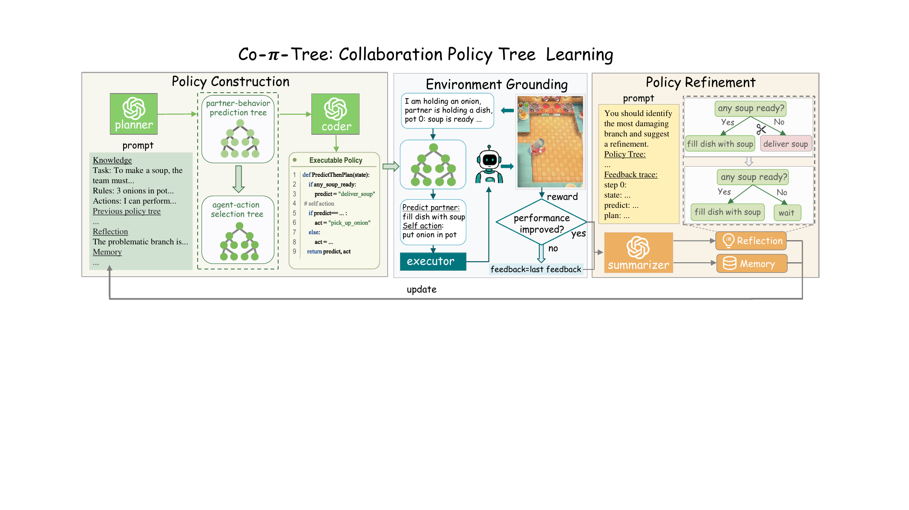
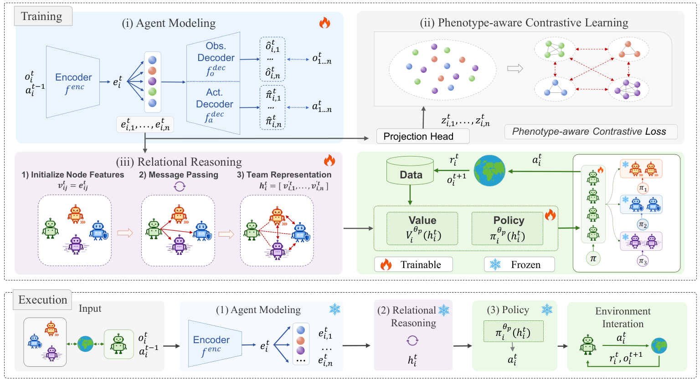
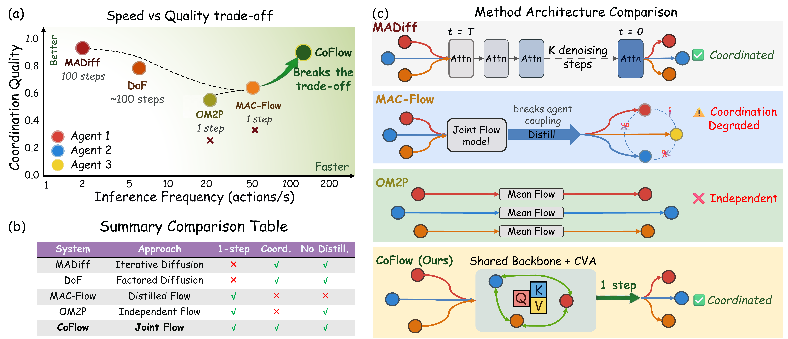

# Beiwen Zhang (章蓓雯)

📧 [zhangbw39@mail2.sysu.edu.cn](mailto:zhangbw39@mail2.sysu.edu.cn)

## About Me

I am a Master's student in Computer Technology at **Sun Yat-sen University**, School of Computer Science and Engineering, advised by **Prof. Hejun Wu**. I received my B.Eng. in Computer Science and Technology from **Central South University** in 2025.

My research interests include **multi-agent systems**, **ad hoc teamwork**, **human-AI collaboration**, **interpretable decision-making**, and **large language models**.

## Papers

<table>
  <tr>
    <td width="190" align="center"></td>
    <td><strong>Co-π-tree: Distilling LLM Reasoning into an Interpretable Policy Tree for Human-AI Collaboration</strong> Findings of EMNLP 2026 <strong>Beiwen Zhang</strong>, Yongheng Liang, Guowei Zou, Haitao Wang, Hejun Wu. <a href="https://arxiv.org/abs/2606.08596">Paper</a> · <a href="https://beiwenzhang.github.io/Co-pi-tree/">Project Page</a></td>
  </tr>
  <tr>
    <td width="190" align="center"></td>
    <td><strong>PACT: Phenotype-Aware Contrastive Team Representation for Multi-Phenotype Grouped Ad Hoc Teamwork</strong> arXiv preprint, 2025; revised 2026 <strong>Beiwen Zhang</strong>, Yongheng Liang, Guowei Zou, Haitao Wang, Liu Cong, Hejun Wu. <a href="https://arxiv.org/abs/2510.25340">Paper</a></td>
  </tr>
  <tr>
    <td width="190" align="center"></td>
    <td><strong>CoFlow: Coordinated Few-Step Flow for Offline Multi-Agent Decision Making</strong> arXiv preprint, 2026 Guowei Zou, Haitao Wang, <strong>Beiwen Zhang</strong>, Boning Zhang, Hejun Wu. <a href="https://arxiv.org/abs/2605.01457">Paper</a> · <a href="https://guowei-zou.github.io/coflow/">Project Page</a></td>
  </tr>
</table>

## Education & Experience

-  **M.Eng. in Computer Technology**, Sun Yat-sen University, 2025–2028 (expected)
-  **B.Eng. in Computer Science and Technology**, Central South University, 2021–2025
-  **LLM Algorithm Research Intern**, vivo Mobile Communication Co., Ltd., Oct. 2024–Mar. 2025

## Honors & Awards

- First-Class Graduate Scholarship, Sun Yat-sen University, 2026.
- Outstanding Graduate Student Union Core Member (University-level), Sun Yat-sen University, 2026.
- Second-Class Graduate Scholarship, Sun Yat-sen University, 2025.
- National Scholarship, Ministry of Education of China, 2024.
- Outstanding Student, Central South University, 2024.
- National Second Prize, Chinese Collegiate Computing Competition, 2023.
- National Third Prize, China College Students’ Service Outsourcing Innovation and Entrepreneurship Competition, 2023.
- National Second Prize, RoboCup 2D Simulation League, 2023.
- Second Prize, Asia-Pacific Mathematical Contest in Modeling, 2023.
- National Second Prize, National English Competition for College Students, 2023.

## Image sources

University marks come from the official [Sun Yat-sen University](https://www.sysu.edu.cn/) and [Central South University](https://www.csu.edu.cn/zjzn/xxbs/xh.htm) sites; the vivo mark comes from [vivo](https://www.vivo.com/en/). Research figures are from the [Co-π-tree project page](https://beiwenzhang.github.io/Co-pi-tree/), [PACT arXiv HTML](https://arxiv.org/html/2510.25340v2), and [CoFlow project page](https://guowei-zou.github.io/coflow/).
